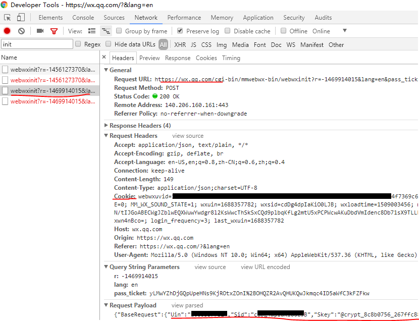

example to use hubot-another-weixin
===================================

This script will run periodic task which specified by HUBOT_EXT_CMD_BIN and HUBOT_EXT_CMD_ARG) every HUBOT_CHECK_INTERVAL.
The return message will be send via gntp-send and wechat.
The target wechat user is specified by HUBOT_TARGET_NICKNAME and HUBOT_TARGET_REMARKNAME.
The gntp server is specified by HUBOT_GNTP_SERVER and HUBOT_GNTP_PASSWORD.

# create hubot

```bash
$ npm install -g coffee-script
$ npm install -g yo

$ mkdir -p ~/hubot && cd ~/hubot
$ npm install generator-hubot
$ yo hubot

$ npm install hubot-another-weixin
$ cp node_modules/hubot-another-weixin/example/schedule-monitor.coffee scripts/
```

# get wechat arguments

## login https://wx.qq.com

get Cookie(Request Headers) and BaseRequest(Request Payload) from browser debug console.
for example, from chrome



## update config.yaml

```
$ cp node_modules/hubot-another-weixin/config.yaml config.yaml
update the following parameter:
- cookie
- Uin
- Sid
- Skey
- DeviceID
```

# example - schedule-monitor

```bash
export HUBOT_TARGET_NICKNAME="xxx"
export HUBOT_TARGET_REMARKNAME="xxx"
export HUBOT_CHECK_INTERVAL="15"
export HUBOT_EXT_CMD_BIN="/home/xjimmy/gopath/src/github.com/jimmy-xu/talk915/main"
export HUBOT_EXT_CMD_ARG="--username xxxxxxxxx --password=xxxxxxxxxxx --period=0 --quiet"
export HUBOT_GNTP_SERVER="192.168.1.23"
export HUBOT_GNTP_PASSWORD="xxxxxxxx"

$ npm install node-growl
$ ./bin/hubot -n "talk915bot" -a another-weixin
```

# example - weixin-notify-growl

**comment**: If the message had been read on wechat app of PC or Phone, then hubot will not receive the notification.

```bash
export HUBOT_GNTP_SERVER="192.168.1.23"
export HUBOT_GNTP_PASSWORD="xxxxxxxx"
export HUBOT_WATCH_GROUPS="HyperHQ,我爱我家"
export HUBOT_WATCH_USERS=""
export HUBOT_WATCH_GH="中国移动139邮箱"

$ npm install node-growl
$ PORT=8100 ./bin/hubot -n "wxbot" -a another-weixin
```
